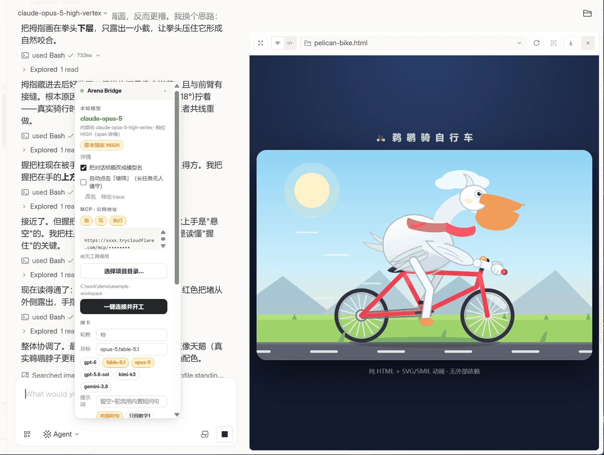
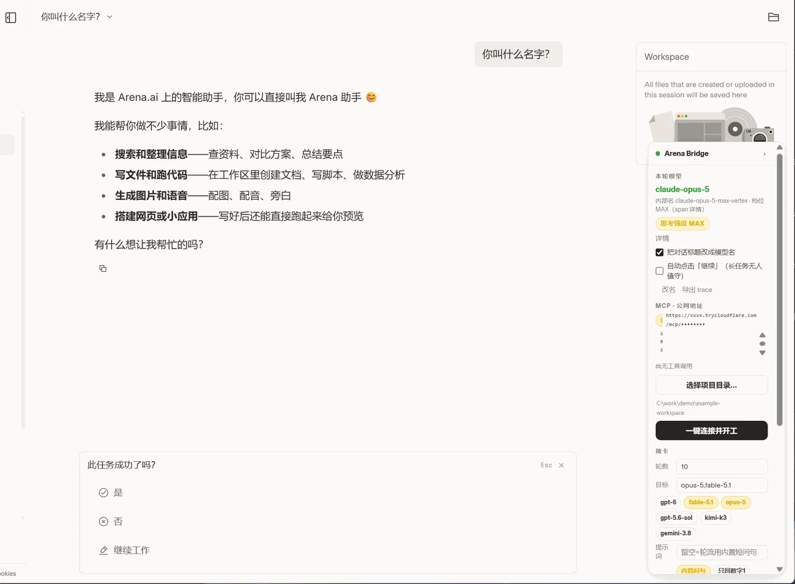
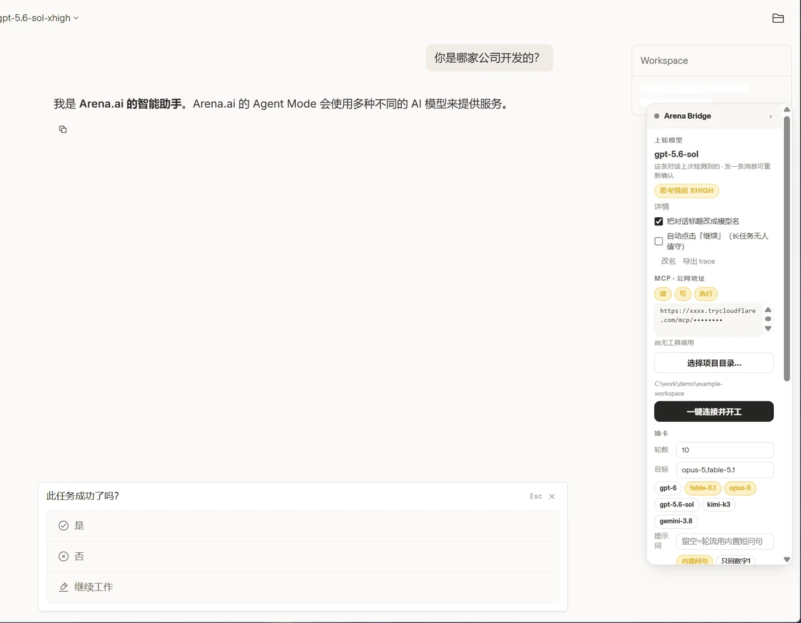
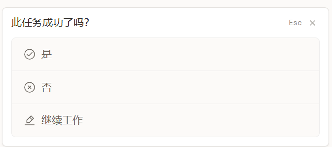

# Arena Bridge

**把 Arena 的网页 Agent 接到你的本机项目上。**

Arena Bridge 通过 MCP，为 Arena Agent 提供读取文件、搜索代码、修改内容和执行命令的能力。
连接项目后，你可以直接在 Arena 对话中让它修改代码、补充测试、运行脚本，并根据执行结果继续处理任务。

桌面版将 Arena 页面、本地 MCP 服务、连接隧道和控制面板整合在一个窗口中，
方便选择项目目录、调整权限和查看连接状态。

此外，Arena Bridge 可从会话响应与运行记录中识别**模型名称与推理档位**，
并提供按目标关键词自动「抽卡」、命中即停的功能，方便找到目标模型后继续使用当前对话。

> 模型信息来自平台返回的消息流与 run trace，面板区分快速识别与确认状态。
> 通用识别规则减少了对固定模型清单的依赖；识别结果与耗时仍取决于平台返回的信息。

[](LICENSE)




左：Arena 对话与工具调用　中：模型与推理档位面板　右：Agent 在本机生成的页面

---

## 快速开始

### 桌面版（推荐）

**方式一 · 下载 Windows 完整包** —— 解压后启动，无需单独安装 Node.js 和 Electron：

[**下载最新版本**](https://github.com/ekkkcz/Arena-Bridge/releases/latest) → 解压 → 双击 `start-desktop.cmd`

**方式二 · 从源码启动（Windows）** —— 需要 Node.js 18+，首次运行自动安装 Electron：

```cmd
git clone https://github.com/ekkkcz/Arena-Bridge.git
cd Arena-Bridge && start-desktop.cmd
```

登录 Arena 并进入 Agent 模式，在右侧面板选择项目目录，等待连接就绪后点击 **一键连接并开工**。
Agent 调用 `get_project_info` 确认项目与权限后，就可以开始安排任务：

```
把这个项目的测试补全，跑到全绿
重构 src/parser.js，拆成三个模块
读一遍 README，把过时的示例改掉
```

Agent 可以**列目录、读文件、搜索代码、写文件、应用文本补丁和运行命令**。
面板提供 **读 / 写 / 执行** 权限控制，命令执行默认关闭；需要运行测试或脚本时再开启。

> **想继续使用当前模型？** 出现「此任务成功了吗？」提示时，请选择 **继续工作** 再安排后续任务。根据作者的使用经验，这样更有可能保留当前模型；仅停留在同一对话中并不能保证模型不变。

> 也可以先运行 `npm install`，再双击 `Arena Bridge.vbs` 静默启动桌面版。
> 访问密钥首次运行自动生成在 `.arena-bridge/config.json`，**不入库**。

**适合个人项目、脚本调试和原型开发**，由你查看执行过程并确认结果。
模型分配、平台额度和隧道连接会影响使用体验，本项目不提供无人值守生产任务所需的稳定性保证。

### 命令行版

```bash
node server/cli.mjs                    # 只读（先从这个开始）
node server/cli.mjs --write            # + 写文件
node server/cli.mjs --write --exec     # + 执行命令
node server/cli.mjs --dir "D:\proj"    # 指定目录
node server/cli.mjs --no-tunnel        # 仅本机
```

命令行版提供独立的 **MCP 服务端**，服务本身仅使用 Node.js 内置模块，
也可供支持其 HTTP 传输方式的其他 MCP 客户端连接。启动后会打印连接地址与示例指令：

```
https://xxxx.trycloudflare.com/mcp/<密钥>

连接这个 MCP。工作目录是 C:\...\example-workspace
请先调用 get_project_info 确认，然后告诉我你能看到哪些工具。
```

> 建议先调用 `get_project_info`，确认连接成功、项目目录正确，再安排修改任务。

---

## 核心功能

### 1 · 在 Arena 对话中操作本机项目

通过本地 MCP 服务提供项目工具，并使用 cloudflared 隧道供网页 Agent 连接。
Quick Tunnel 无需单独注册 Cloudflare 账号；使用 Arena 仍需登录你的 Arena 账号。工具按权限开放：

| | 可用工具 |
| --- | --- |
| 读 | `get_project_info` `list_files` `read_file` `search` |
| + 写 | 上面 + `write_file` `apply_patch` |
| + 执行 | 上面 + `run_command` |

**桌面版**在面板上点 `读 / 写 / 执行` 三个开关即可（默认读 + 写）；
**命令行版**用启动参数，默认只有读：`--write`、`--write --exec`。

文件工具包含项目路径检查，命令工具设有可执行文件白名单，并提供超时与输出长度限制。
这些控制不等同于系统沙箱；开启执行权限后，命令能够访问的资源仍受本机账户权限影响。

### 2 · 识别会话模型，按目标自动抽卡

对于 Arena Agent 随机分配模型的会话，面板帮助你查看识别到的模型名称和推理档位，
也可以按目标关键词自动尝试新对话：

```
新开对话 → 发一句「你好」 → 看面板
   ├─ 符合目标 → 留在当前对话；出现任务反馈弹窗时选「继续工作」
   └─ 继续寻找 → 设置关键词，点击「开始抽卡」
```

识别分为两个阶段，耗时取决于会话响应和运行记录的返回速度：

| 阶段 | 信息来源与状态 |
| --- | --- |
| 快速识别 | 从消息流提取模型名称，标注为未确认 |
| 运行记录复核 | 根据 Trigger.dev run trace 补充和核对模型信息 |

下面是一次历史命中示例：目标为 `opus-5`，识别到 `claude-opus-5`，推理档位为 MAX。
截图展示当时的结果，不代表当前模型供应或命中概率。





第二张示例中，模型名 `gpt-5.6-sol` 不带档位后缀，面板从 run trace 的 span 详情中读出了 **XHIGH**。
档位可能来自模型名后缀或运行记录字段，具体来源以面板标注为准。

常规抽卡可设置轮数（1–200）、目标关键词（如 `opus,astra,fable`，大小写无关的子串匹配）和命中即停。
命中后可在对应对话中继续任务；使用仍受平台额度、限流和模型分配影响。

**命中后如何更有可能保留当前模型？**

当 Arena 弹出「此任务成功了吗？」时，如果还想让当前模型接着处理任务，请点击 **继续工作**，再发送后续要求。



根据作者的使用经验，选择「继续工作」更有可能保留当前模型；未选择时，后续任务可能被分配给其他模型。
这不是锁定模型的保证，继续任务时仍建议留意面板中的模型识别结果。

---

## 常见问题

**地址会变吗？**　Quick Tunnel 每次启动都变。要固定就换 Named Tunnel 或 ngrok。

**国内连不上？**　cloudflared 走 QUIC/UDP 7844，普通 HTTP 代理**无效**，需要 TUN/全局代理。

**面板不显示模型名？**　① 确认在 **Agent 模式**；② **刷新页面**（改扩展后必须 F5）；③ 让它先调用一次工具；④ 控制台跑 `window.__amp3State()`。

**如何控制权限？**　连接地址包含访问密钥，请勿公开分享。可以先使用只读模式，再按任务需要开启写入和执行权限。

**需要安装哪些依赖？**

- **Windows 完整包**：无需单独安装 Node.js 和 Electron。
- **从源码启动或使用命令行版**：需要 Node.js 18+。
- **命令行版的隧道连接**：需要安装 cloudflared；只供本机客户端连接时，可用 `--no-tunnel` 跳过隧道。

Windows 安装 cloudflared 的命令：

```bash
winget install --id Cloudflare.cloudflared --exact
```

---

## 目录结构

```
arena-bridge/
├─ start-desktop.cmd     ★ 双击这个（首次会自动 npm install）
├─ Arena Bridge.vbs      静默启动（无黑框；已装好依赖后用）
├─ desktop/
│  ├─ launcher/          原生启动器 Arena Bridge.exe（C#，45 KB）
│  └─ app/
│     ├─ main.cjs        主进程：内置 MCP + 隧道 + 探针注入 + 抽卡引擎
│     └─ preload.cjs     ★ 唯一的 UI：跟随 Arena 设计变量的右侧面板
├─ server/               命令行版
│  ├─ cli.mjs
│  └─ lib/{mcp,tools,tunnel,config}.mjs
├─ extension/            浏览器扩展（命令行版配它看模型名）
├─ example-workspace/    默认项目目录
└─ docs/                 调研 · 实测 · 截图
```

---

## 历史实测记录

以下为仓库已有的实测记录，便于了解曾验证的场景；具体环境与原始输出见下方报告。

| 项 | 结果 |
| --- | --- |
| 官方 MCP SDK 客户端连接 | ✅ |
| 只读 / 读写 / 执行 三档 | ✅ 4 / 6 / 7 个工具 |
| 目录越界 · 命令白名单 | ✅ 均被拒 |
| Arena Agent 读写本机文件 | ✅ |
| Arena Agent 修 bug 至测试全绿 | ✅ 9/9 |
| 模型名识别 | ✅ opus-5 / gpt-5.5 / gpt-5.6-sol / gpt-6-astra-* |
| 推理档位解析 | ✅ 15 个模型名样本通过 |
| 面板跟随 Arena 主题 | ✅ 浅色 ↔ 深色 |
| 隧道断线保护 | ✅ 未就绪时锁按钮（防 1033） |

更详细的过程见 [docs/实测报告.md](docs/实测报告.md) 与 [docs/调研报告.md](docs/调研报告.md)。

---

## 链接

- [docs/项目介绍.md](docs/项目介绍.md) —— 适合社区发布、群聊分享和演示视频的介绍文案
- [docs/实测报告.md](docs/实测报告.md) —— MCP 通路实测原始输出
- [docs/调研报告.md](docs/调研报告.md) —— 原理、收费模式、可行性评估
- [desktop/README.md](desktop/README.md) —— Electron 方案取舍与踩坑

MIT © 2026 ekkkcz
